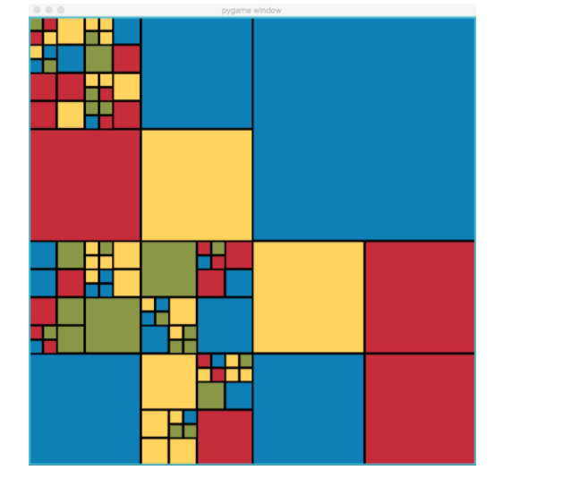
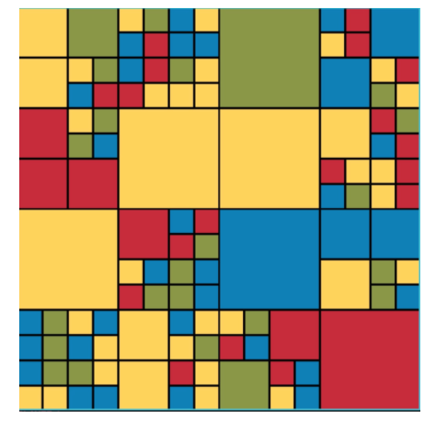
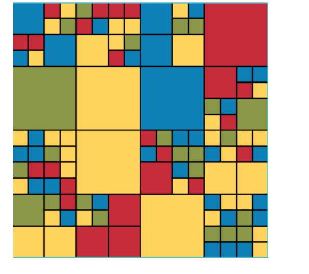
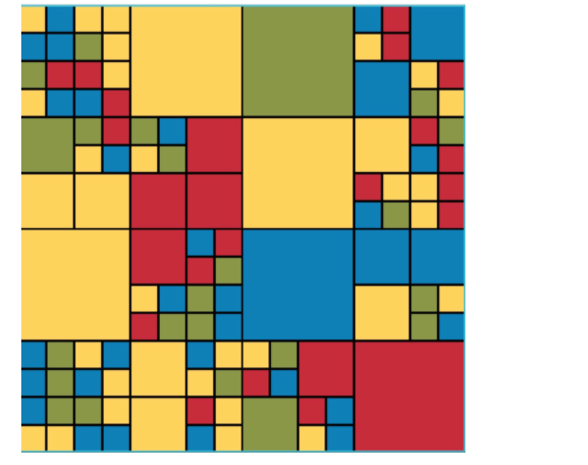
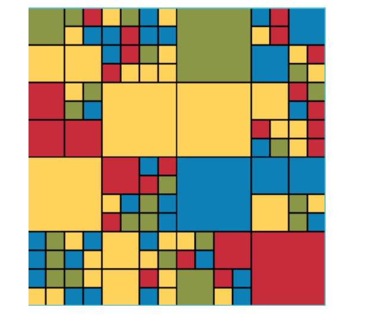

### Introduction to the Blocky Game

Blocky is a game with simple moves on a simple structure. But, like a Rubik’s Cube, it is quite challenging to play. The game is played on a randomly-generated game board made of squares of four different colours, such as this:
 

 
Each player has their own goal that they are working towards, such as creating the largest connected “blob” of blue. After each move, the player sees their score, which is determined by how well they have achieved their goal and which moves they have made. The game continues for a certain number of turns, and the player with the highest score at the end is the winner. Next, let’s look in more detail at the rules of the game and the different ways it can be configured for play.

## The Blocky board and terminology

We call the game board a ‘block’, which is best defined recursively. A block is either:
- a square of one colour, or
- a square that is subdivided into 4 equal-sized blocks.
The largest block of all, containing the whole structure, is called the top-level block. We say that the top-level block is at level 0. If the top-level block is subdivided, we say that its four sub-blocks are at level 1. More generally, if a block at level k is subdivided, its four sub-blocks are at level k+1.

A Blocky board has a **maximum allowed depth**, which is the number of levels down it can go. A board with maximum allowed depth 0 would not be fun to play on – it couldn’t be subdivided beyond the top level, meaning that it would be of one solid colour. This board was generated with maximum depth of 5:
 

For scoring, the units of measure are squares the size of the blocks at the maximum allowed depth. We will call these blocks unit cells.
 
## Actions and Moves

A number of actions can be performed in Blocky. A move is an action that is performed on a specific block. The actions are:
1.	Rotate clockwise
2.	Rotate counterclockwise
3.	Swap Horizontally
4.	Swap Vertically
5.	Smash
6.	Paint
7.	Combine
8.	Pass

The **Smash** action can only be performed on blocks with no children. If a block is smashed, then it is sub-divided into four new, randomly-generated sub-blocks. Smashing a unit cell is also not allowed (it is already at the maximum depth).

The **Paint** action sets a block’s colour to a new, specified colour. It can only be performed on unit cells.

The **Combine** action turns a block into a leaf based on the majority colour of its children. It can only be performed on a block that is subdivided and whose children are at the maximum depth. If there is a majority colour among the four children, then the children are discarded and the block has the majority colour. A majority colour means that one colour is the majority amongst all children; a tie does not constitute a majority.

The **Pass** action does not mutate the block. It can be used by a player who wishes to skip their turn.

## Choosing a block and levels

What makes moves interesting is that they can be applied to any block at any level. For example, if the user selects the entire top-level block for this board:

 

and chooses to rotate it counter-clockwise, the resulting board is this:

 

But if instead, on the original board, they rotated the block at level 1 (one level down from the top-level block) in the upper left-hand corner, the resulting board is this:
 
 

And if instead they were to rotate the block a further level down, still sticking in the upper-left corner, they would get this:

Of course there are many other blocks within the board at various levels that the player could have chosen.

## Players

The game can be played solitaire (with a single player) or with two to four players. There are three kinds of players:
1.	A **human player** chooses moves based on user input.
2.	A **random player** is a computer player that, as the name implies, chooses moves randomly.
3.	A **smart player** is a computer player that chooses moves more intelligently: It generates a set of random moves and, for each move, checks what its score would be if it were to make that move. Then it picks the one that yields the best score.

## Goals and scoring

At the beginning of the game, each player is assigned a randomly-generated goal. There are two types of goal:
1.	**Blob goal.**
The player must aim for the largest “blob” of a given colour c. A blob is a group of connected blocks with the same colour. Two blocks are connected if their sides touch; touching corners doesn’t count. The player’s score is the number of unit cells in the largest blob of colour c.
2.	**Perimeter goal.**
The player must aim to put the most possible units of a given colour c on the outer perimeter of the board. The player’s score is the total number of unit cells of colour c that are on the perimeter. There is a premium on corner cells: they count twice towards the score.
Notice that both goals are relative to a particular colour. We will call that the **target colour** for the goal.

In addition to the points gained by the player from achieving their goal, a player can also lose points based on the actions they perform.
•	Rotating, Swapping, and Passing cost 0 points.
•	Painting and Combining cost 1 point each time they are performed.
•	Smashing costs 3 points each time it is performed.

## Configurations of the game

A Blocky game can be configured in several ways:
•	**Maximum allowed depth.**
While the specific colour pattern for the board is randomly generated, we control how finely subdivided the squares can be.
•	**Number and type of players.**
There can be any number of players of each type. The “difficulty” of a smart player (how hard it is to play against) can also be configured.
•	**Number of moves.**
A game can be configured to run for any desired number of moves. (A game will end early if any player closes the game window.)
